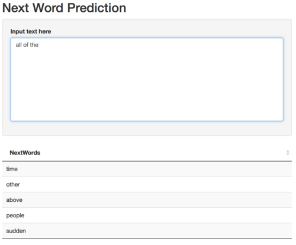

# LanguageModeling

The aim of this project is to predict the next word of a sentence using different BackOff Ngrams Language Models

# Next Word Prediction

The aim of the project is to develop an app - possibly using a novel algorithm - to predict the next word given a phrase or fragment of a sentence. A large corpus of data - consisting of English language content from tweets on Twitter, blogs and news groups was provided by the course team (and originally from http://www.corpora.heliohost.org/ ), in order to train and test prediction models. Two main models were investigated:

- N-gram models with a simple backoff 
- N-gram models with a Katz backoff 

# Simple BackOff Model

- A simple quadgram backoff modeling approach, trained on this collection of ngrams, was used to predict a subsequent word.
- With this approach, a subsequent word is predicted by using progressively shorter histories.
    + For example, let’s say you type “I love the” in order to see what the next predicted word is.
    + If the model contains a number of words that follow “I love the”, the most frequent terms are suggested.
    + If the model does not contain any words that follow “I love the”, the first word of the term is backed-off so that the model searches for words that follow “love the”.
    + If no words exist, the model searches for the most frequent word that follows “the”.
- We can optimize the memory by keeping only the first 5 most powerful predictions in each group of ngrams, (n-1)grams ... 

# Katz BackOff Model

- Katz's BackOff Model is useful in ngram language modeling to estimate the conditional probability of a word $P(w_{i}\mid w_{i-n+1}\cdots w_{i-1})$ given its history (actually, its preceding words, normally 2-3-4 words).

- The problem is that the corpus for training must be large to cover as much the diversity of language as possible. Nevertheless, there are cases where "large" is not "large enough". Katz's approach is to fall back to lower-order N-gram in this case.

- However, one cannot just fall back like this because this naive approach is unfair. Let's say: A-B-C appears 15 times, while A-B-? totally appear 100 times. As a result, Probability(A-B-C|A-B) = 15%. But A-B-N does not appear, so we fall back to B-N and similarly, find that Probability(B-N|B) = 40%. It is unfair because "A-B" gives more context than just "B", but it is NOT chosen!

- Katz fixes this issue by redistributing some probability of high-order N-gram to lower-order N-gram, so that all of the probabilities accumulate to 1. But first we have to reap some probability of the high-order N-gram, making it available to lower-order N-gram. It is done by using Good-Turing Discounting.

- After having some left-over probability for lower-order N-gram, we distribute it fairly.
That is, in the lower-order N-gram, the N-grams who have more probability to appear will have more share in this left-over probability.

- The equation for Katz's back-off model is:

${\displaystyle {\begin{aligned}&P_{bo}(w_{i}\mid w_{i-n+1}\cdots w_{i-1})\\={}&{\begin{cases}d_{w_{i-n+1}\cdots w_{i}}{\dfrac {C(w_{i-n+1}\cdots w_{i-1}w_{i})}{C(w_{i-n+1}\cdots w_{i-1})}}&{\text{if }}C(w_{i-n+1}\cdots w_{i})>k\\[10pt]\alpha _{w_{i-n+1}\cdots w_{i-1}}P_{bo}(w_{i}\mid w_{i-n+2}\cdots w_{i-1})&{\text{otherwise}}\end{cases}}\end{aligned}}}$

where $C(x)$ = number of times $x$ appears in training, $w_i$ = ith word in the given context, we choose $k=0$

# Optimized Katz's BackOff Model

We then keep only the first 5 rows of a group as we will not predict more than 5 words. This will significantly reduce the size of the used sets of prediction.

In this model, there is a simple approximation used:

${\sum _{{\{w_{i}:C(w_{{i-n+1}}\cdots w_{{i}})\leq k\}}}P_{{bo}}(w_{i}\mid w_{{i-n+2}}\cdots w_{{i-1}})}$ is substitued byn${\sum _{{w_{i}}P_{{bo}}(w_{i}\mid w_{{i-n+2}}\cdots w_{{i-1}})}}$.

∑ P_bo is used over all words instead of ∑ P_bo such that C <= k. 

# Models Evaluation

- Perplexity is theoretically elegant as its logarithm is an upper bound on the number of bits per word expected in compressing (in-domain) text employing the measured model. Unfortunately, while language models with lower perplexities tend to have lower word-error rates, there have been numerous examples in the literature where language models providing a large improvement in perplexity over a baseline model have yielded little or no improvement in word-error rate. In addition, perplexity is inapplicable to unnormalized language models (i.e., models that are not true probability distributions that sum to 1), and perplexity is not comparable between language models with different vocabularies.

- Instead, a simple "AvgScore" calculates the percentage of times the next word is found among the 5 choices suggested by the model.

|  X|Model                       | LoadTime| AvgPredictionTime|  AvgScore|ModelSize |
|--:|:---------------------------|--------:|-----------------:|---------:|:---------|
|  1|KatzBackOffModel            | 1.544625|         2.2337806| 0.2062408|348.7 Mb  |
|  2|KatzBackOffModelOptimized   | 1.338524|         1.6286578| 0.2071281|307.9 Mb  |
|  3|SimpleBackOffModel          | 1.172697|         0.4763525| 0.2110240|182.7 Mb  |
|  4|SimpleBackOffModelOptimized | 0.884784|         0.3380016| 0.2110240|152.9 Mb  |

- A detailed notebook explaining all models and steps can be found at http://rpubs.com/maggiemhanna/exploration_modeling_next_word_prediction

- The application is deployed on https://maggiemhanna.shinyapps.io/predictingnextword/ 

# The App

The application can be simply used by entering the text (with no size limit), the most powerful 5 possibilities of next words will then be shown.

